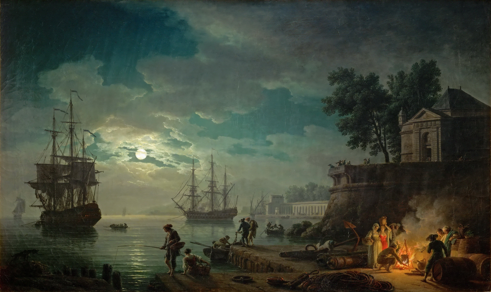

#Bio

I'm a fresh PhD student at Tsinghua University, majoring in computer system and architecture.

Currently I'm reading papers posted on recent years' ISCA, MICRO, HPCA and ASPLOS.

Hometown is Chengdu, Sichuan.

Keen on various kinds of music(except ballad ones), recently fascinated by trap and the group Higher Brothers.

